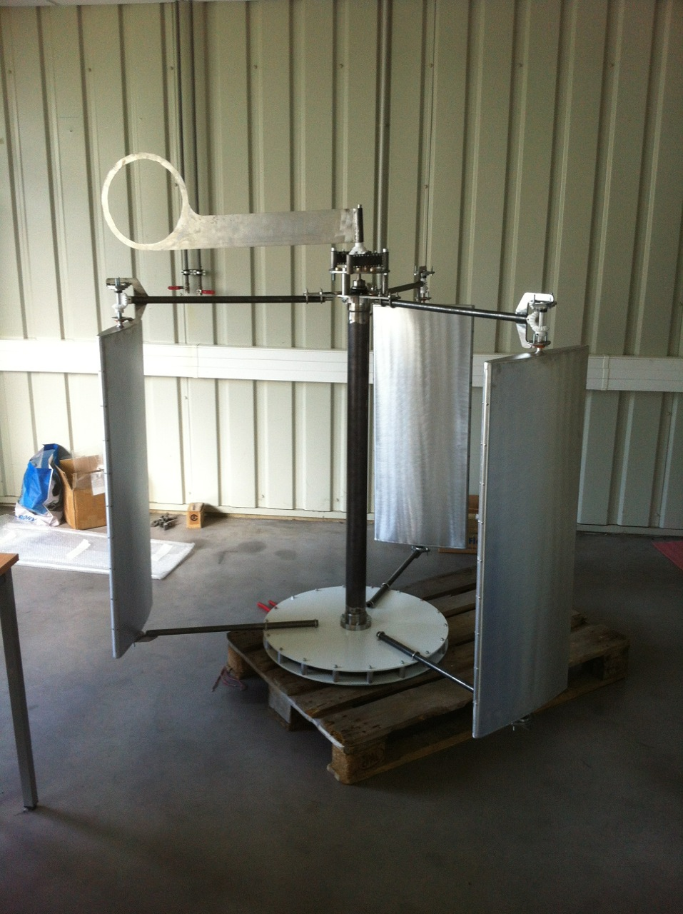

urbolienne
==========

You will find on this webpage all the documents relative to the [AeroSeeD](http://www.aeroseed.com)'s wind turbine (the "urbolienne").

The Urbolienne Project website : http://www.energinov.org

Licenses
--------

The urbolienne's 2D drawings and 3D models are made available under the terms of the TAPR Open Hardware License (http://tapr.org/ohl). See the "TAPR license.txt" file that accompanies this distribution for the full text of the license.

The urbolienne's documentation is made available under the terms of the GNU Free Documentation Licence (https://www.gnu.org/licenses/fdl.html). See the "GNU Free Documentation License.txt" file that accompanies this distribution for the full text of the license.

Disclaimer
----------

This hardware/software is provided "as is", and you use the hardware/software at your own risk. Under no circumstances shall any author be liable for direct, indirect, special, incidental, or consequential damages resulting from the use, misuse, or inability to use this hardware/software, even if the authors have been advised of the possibility of such damages.
